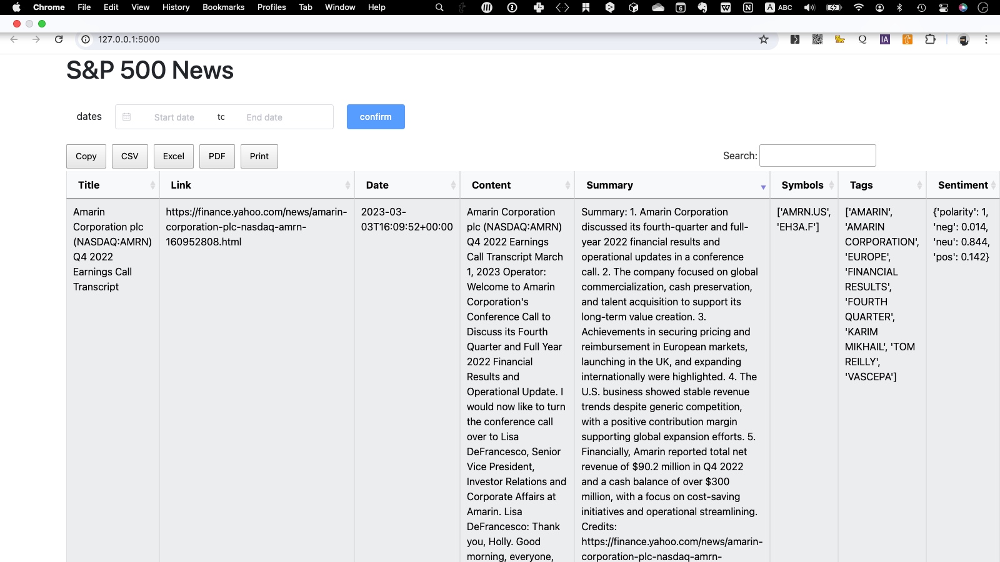

## stock news aggregation system 

Here are some features of the system:

- Automated news collection from various financial news outlets by eodhd-openAPI.

- Initial setup for integrating ChatGPT to condense news content and perform data cleaning.

 


## config.py

Create a config.py file in the project root containing your EODHD APIs token.


 ```Java
    API_TOKEN = "YOUR_TOKEN"
    OPENAI_KEY = "YOUR_TOKEN"
 ```


run this project:


 ```Java
 python -m venv .venv
 . .venv/bin/activate
 . .venv/bin/activate
  pip install -r requirements.txt
  import openai
  
python app.py --host 0.0.0.0 --port 5000 --debug                

 ```
 